**校园信息聚合论坛系统（校园通）使用与部署文档**

姓名(组长)：朱子豪   学号：2312190118    班级：计科2301

前端主要界面展示：
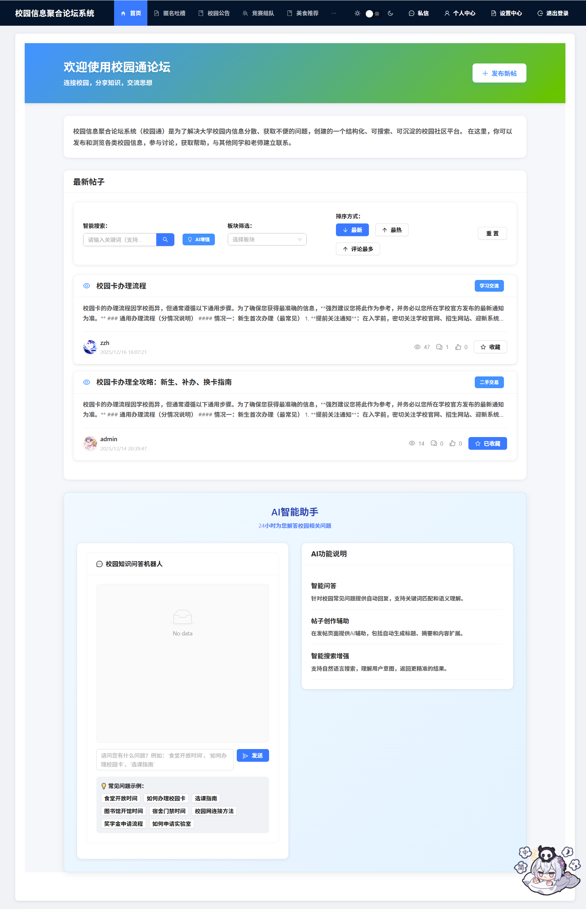
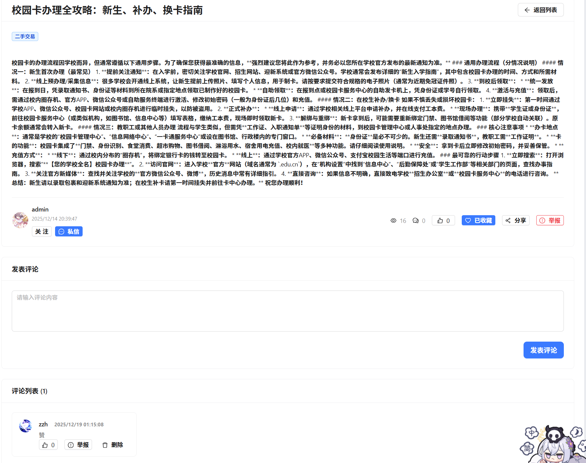

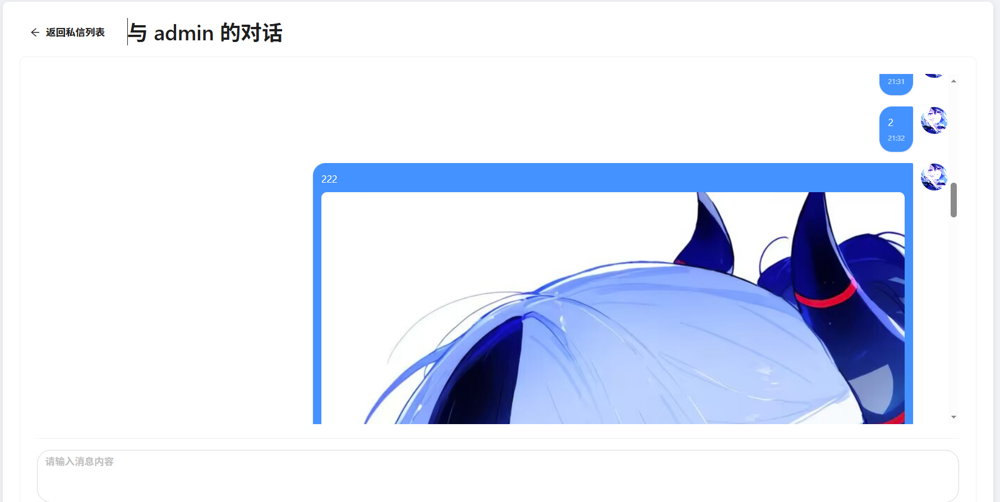
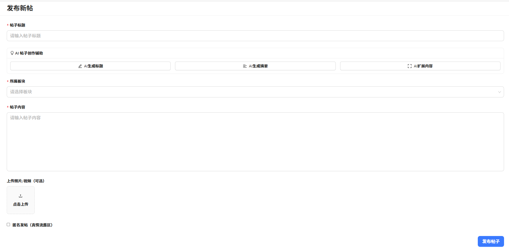


## 一、文档介绍

本文档为校园信息聚合论坛系统（校园通）的使用与部署文档，旨在指导用户如何使用和部署该系统。

## 二、系统概述

校园信息聚合论坛系统（校园通）是一个面向校园用户的信息交流平台，提供帖子发布、浏览、评论、私信、AI助手等功能，旨在促进校园内信息的高效传播和交流。

## 三、系统运行环境

### 3.1 前端环境
- Node.js >= 16.0.0
- npm >= 8.0.0

### 3.2 后端环境
- Python >= 3.10
- MySQL >= 8.0
- 推荐使用虚拟环境

## 四、系统运行步骤

### 4.1 后端启动

1. **进入后端目录**
   ```bash
   cd backend
   ```

2. **创建虚拟环境**
   ```bash
   python -m venv venv
   ```

3. **激活虚拟环境**
   - Windows: `venv\Scripts\activate`
   - Linux/Mac: `source venv/bin/activate`

4. **安装依赖**
   ```bash
   pip install -r requirements.txt
   ```

5. **配置环境变量**
   - 创建 `.env` 文件，配置以下内容：
     ```
     SECRET_KEY=your-secret-key
     DEBUG=True
     DB_NAME=campus_forum
     DB_USER=root
     DB_PASSWORD=3147  # 默认密码，可根据实际情况修改
     DB_HOST=localhost
     DB_PORT=3306
     ```

6. **创建数据库**
   ```bash
   # 登录MySQL
   mysql -u root -p
   
   # 创建数据库
   CREATE DATABASE campus_forum CHARACTER SET utf8mb4 COLLATE utf8mb4_unicode_ci;
   
   # 退出MySQL
   exit
   ```

7. **执行数据库迁移**
   ```bash
   python manage.py migrate
   ```

8. **创建超级管理员**
   ```bash
   python manage.py createsuperuser
   ```

9. **初始化板块数据**
   ```bash
   python manage.py create_categories
   ```

10. **启动开发服务器**
    ```bash
    python manage.py runserver 0.0.0.0:8000
    ```

### 4.2 前端启动

1. **进入前端目录**
   ```bash
   cd frontend
   ```

2. **安装依赖**
   ```bash
   npm install
   ```

3. **配置环境变量**
   - 创建 `.env` 文件，配置以下内容：
     ```
     VITE_API_URL=http://localhost:8000
     ```

4. **启动开发服务器**
   ```bash
   npm run dev
   ```

5. **访问系统**
   - 在浏览器中访问：`http://localhost:5173`

## 五、系统界面说明

### 5.1 首页
- **布局**：顶部导航栏 + 主体内容区 + 底部信息
- **主要功能**：
  - 帖子列表展示，支持分页、筛选和排序
  - 智能搜索框，支持关键词搜索和搜索建议
  - AI助手，提供智能问答服务
  - 发布新帖按钮，快速进入发帖页面
  
  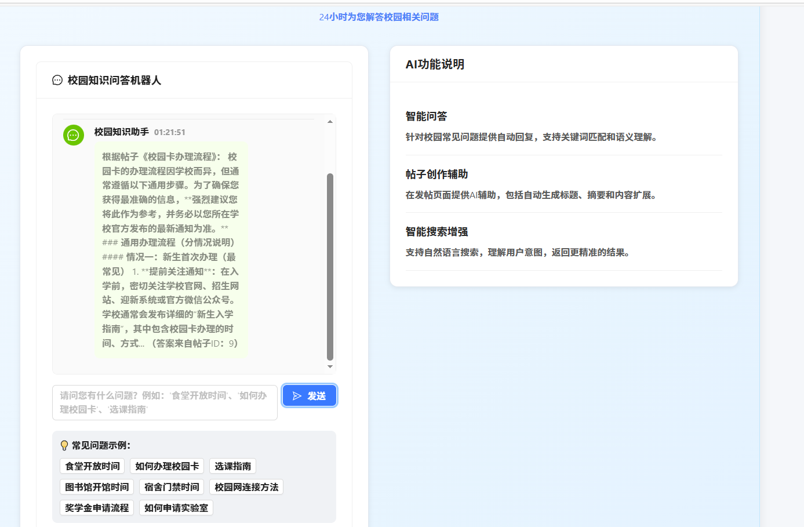

### 5.2 登录/注册页
- **登录功能**：支持用户名/邮箱和密码登录
- **注册功能**：支持填写基本信息注册新账号
- **忘记密码**：支持通过邮箱找回密码
- 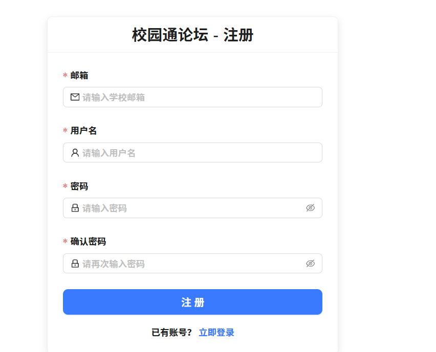
- 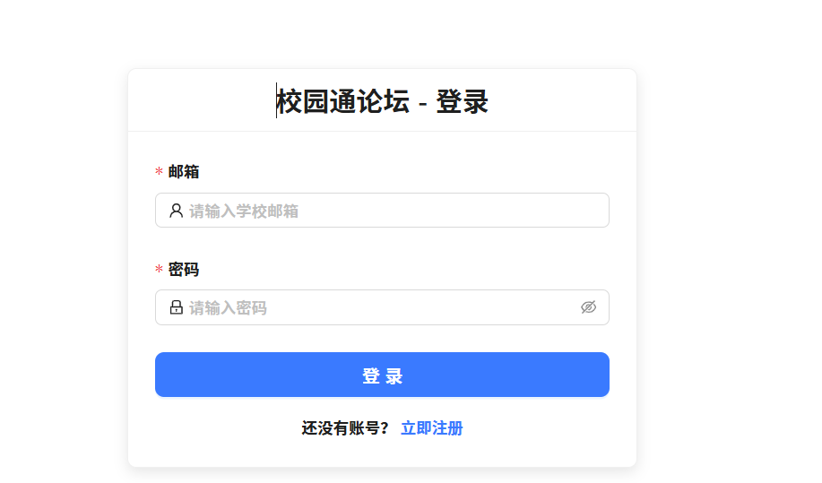

### 5.3 个人中心
- **个人资料**：显示用户基本信息，支持编辑个人资料
- **我的发帖**：展示用户发布的所有帖子，支持查看、编辑和删除
- **我的收藏**：展示用户收藏的帖子，支持取消收藏
- **我的关注**：展示用户关注的其他用户
- **我的粉丝**：展示关注当前用户的其他用户
- **浏览历史**：记录用户浏览过的帖子，支持清空历史
- 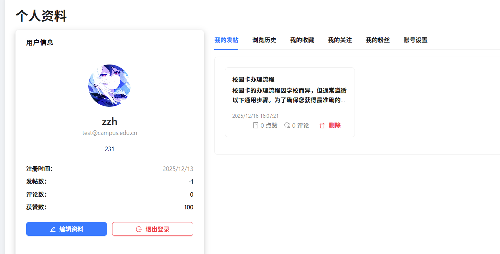
- 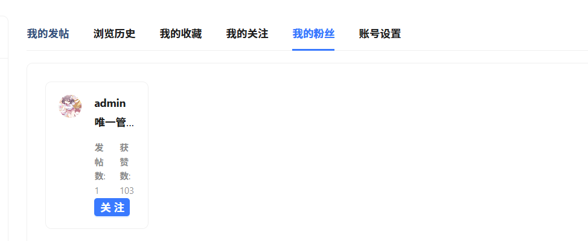
- 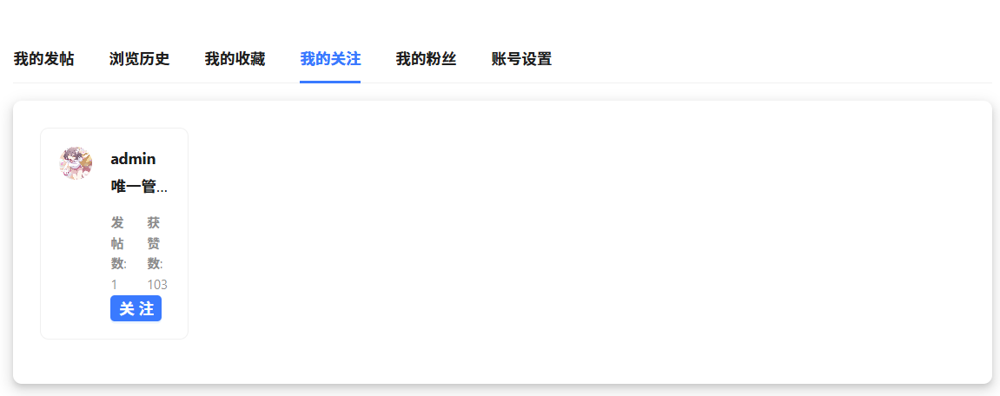
- 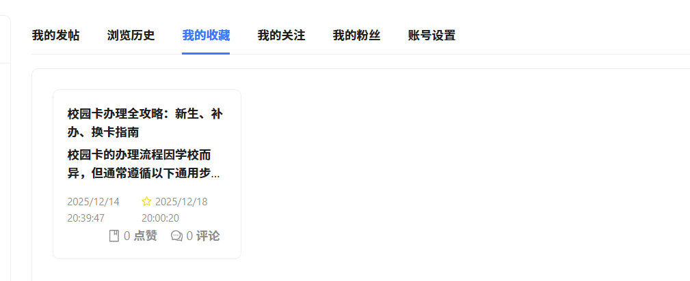
- 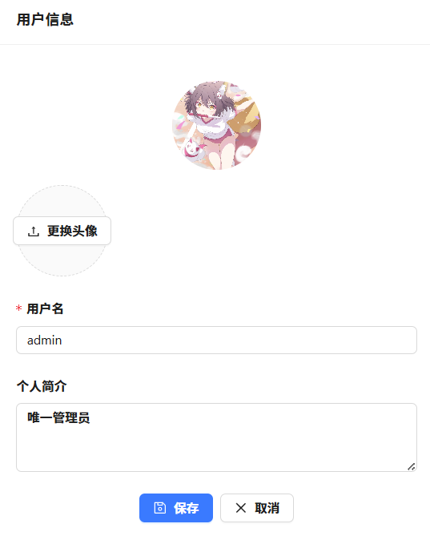
- 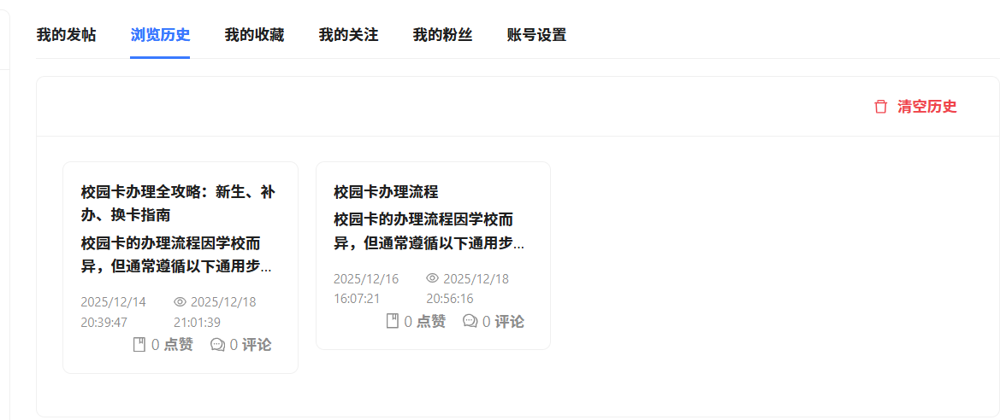

### 5.4 帖子详情页
- **帖子内容**：完整展示帖子标题、内容、图片/视频
- **互动功能**：点赞、评论、收藏、分享
- **用户信息**：显示发帖人信息，支持关注和私信
- **评论区**：展示所有评论，支持回复和点赞
- **举报功能**：支持对他人的评论等举报，举报会反馈到后台给管理员处理
- 
- 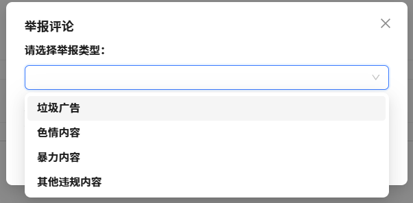

### 5.5 发帖页
- **表单内容**：标题、内容、板块选择、图片/视频上传
- **AI辅助功能**：AI生成标题、AI生成摘要、AI扩展内容
- **预览功能**：实时预览帖子效果
- 
- 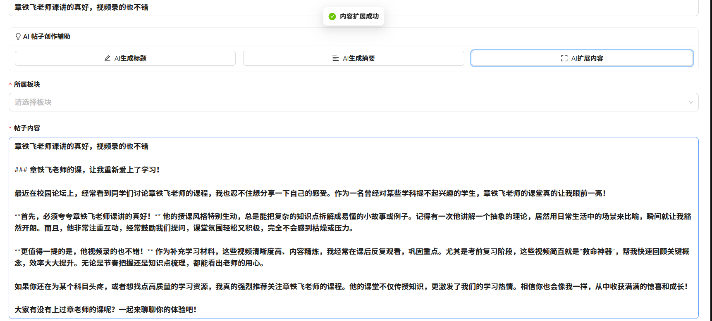

### 5.6 管理员后台
- **用户管理**：查看、编辑、封禁用户
- **内容管理**：查看、审核、删除帖子和评论
- **板块管理**：创建、编辑、删除板块
- **广告管理**：审核、管理广告内容
- **举报管理**：处理用户举报，维护社区秩序
- 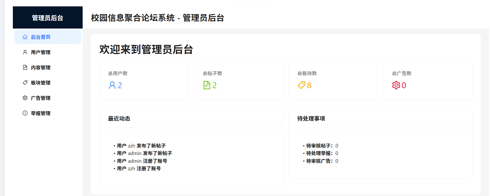
- 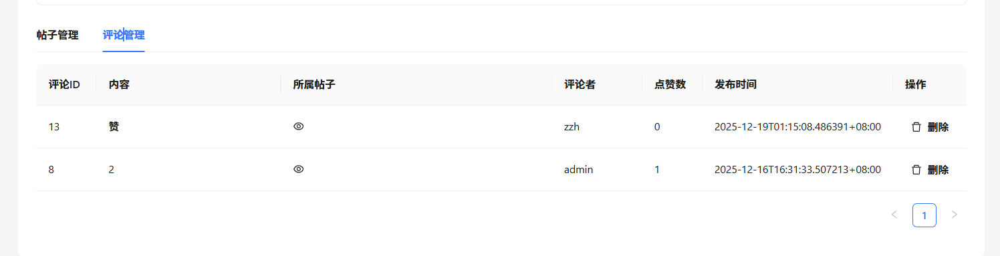
- 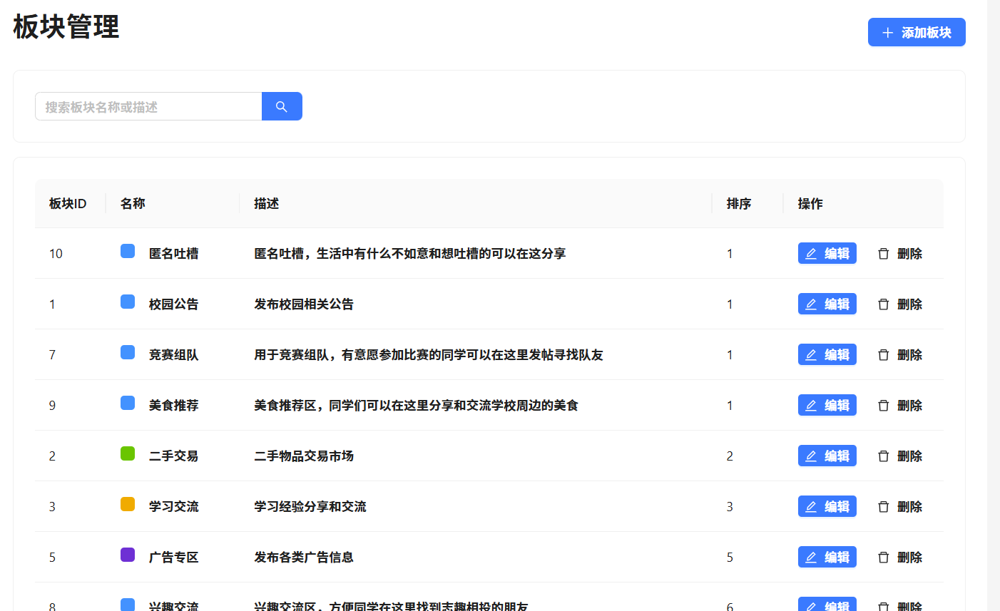
- 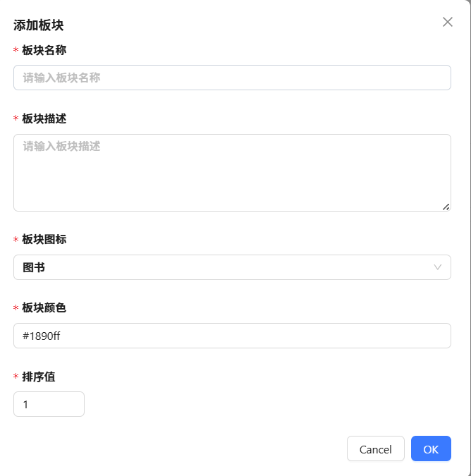
- 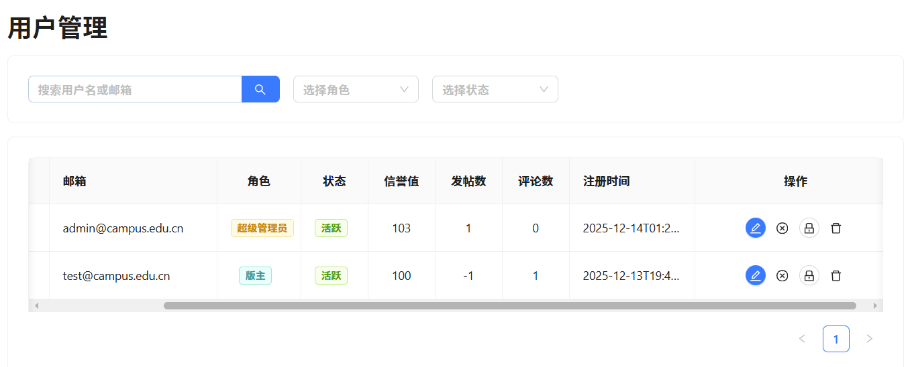
- 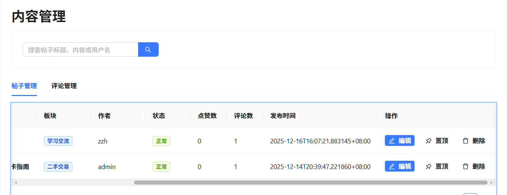
- 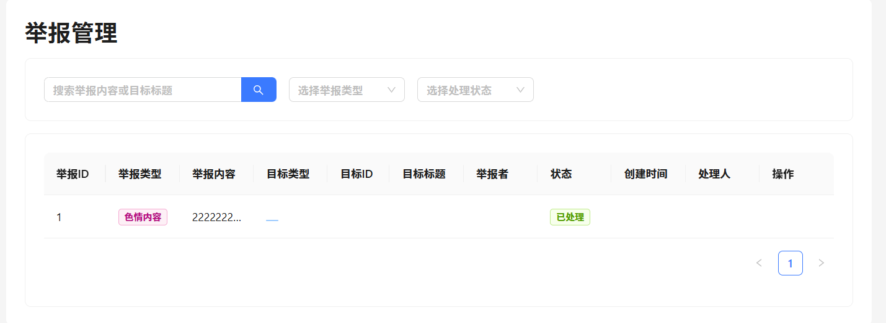
- 

### 5.7 设置中心
- **账号管理**：修改个人资料、绑定手机号/邮箱
- **密码管理**：修改登录密码
- **隐私设置**：控制个人资料、私信、关注等隐私选项
- 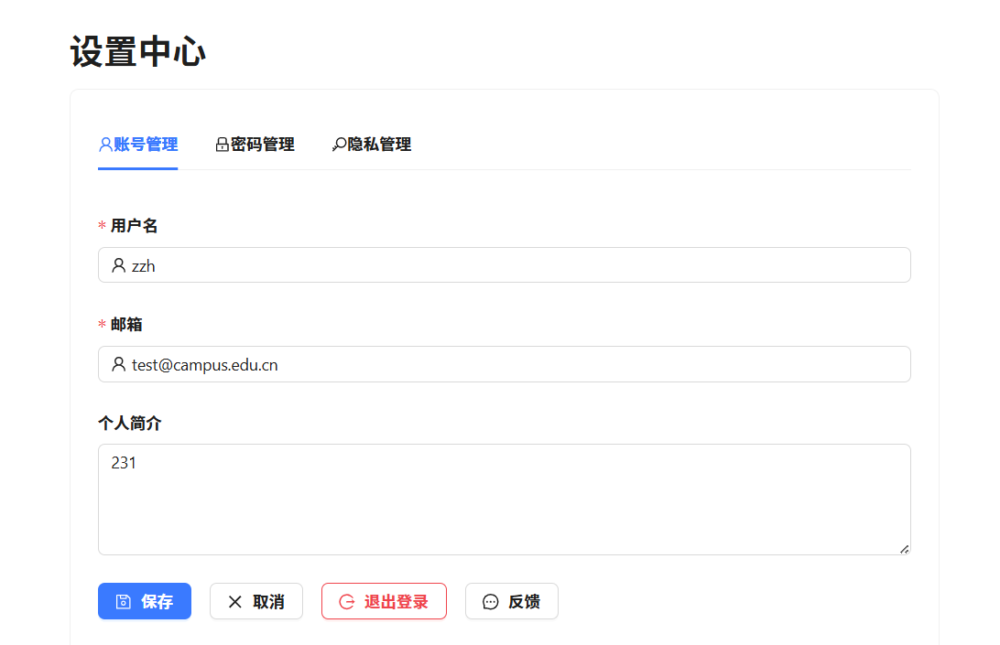
- 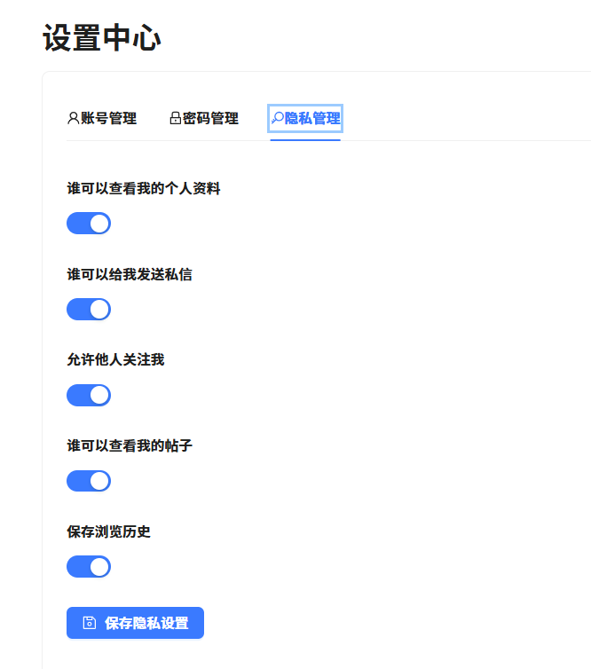
- 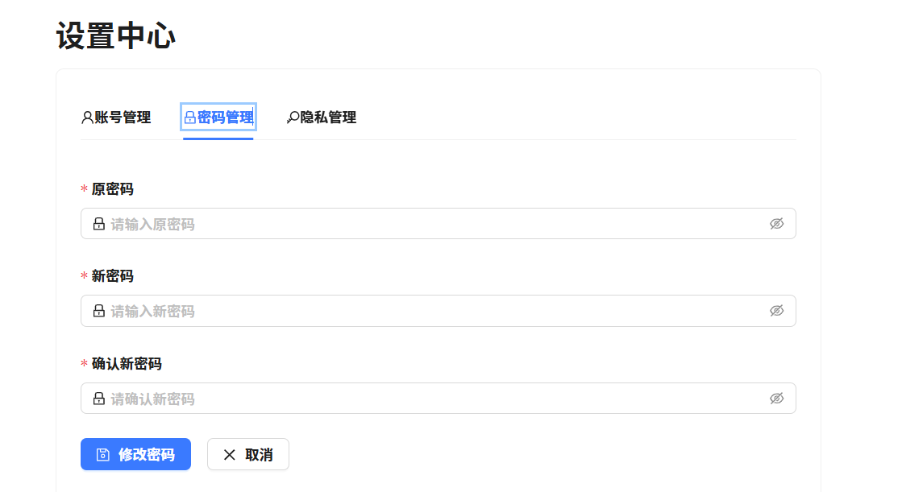
- 
### 5.7 私信
 - **私信中心**：点击私信中心可以进入查看自己与他人的私信记录
 - **私信界面**：支持与他人发送图片或者视频等消息进行交流
 - 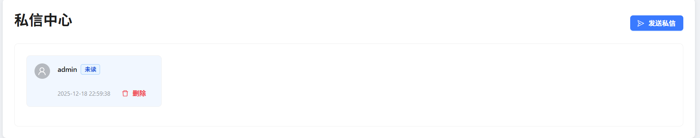
 - 

## 六、系统使用方法

### 6.1 用户管理
#### 6.1.1 用户注册与登录
1. 访问登录页面，点击"立即注册"按钮
2. 填写用户名、邮箱、密码等信息，点击"注册"按钮
3. 注册成功后自动登录，或返回登录页面使用新账号登录

#### 6.1.2 个人资料管理
1. 点击导航栏中的个人头像，选择"个人中心"
2. 在个人中心页面查看和编辑个人资料
3. 点击"账号设置"进入设置中心，配置隐私和通知偏好
4. 在"我的发帖"页面管理自己发布的帖子
5. 在"我的收藏"页面管理收藏的帖子
6. 在"我的关注"和"我的粉丝"页面管理社交关系

### 6.2 内容管理
#### 6.2.1 浏览和搜索帖子
1. 在首页浏览帖子列表，支持上下滚动查看更多
2. 使用顶部搜索框输入关键词，点击搜索按钮或按回车键
3. 使用筛选条件（板块、排序方式）缩小搜索范围
4. 点击帖子标题进入帖子详情页

#### 6.2.2 发布新帖子
1. 点击首页或导航栏中的"发布新帖"按钮
2. 填写帖子标题和内容
3. 选择所属板块
4. 点击"上传图片/视频"按钮添加媒体文件（最多5张图片）
5. 可使用AI辅助功能优化帖子内容
6. 点击"发布"按钮提交帖子

#### 6.2.3 帖子管理
1. 在个人中心的"我的发帖"页面查看所有发布的帖子
2. 点击"编辑"按钮修改帖子内容
3. 点击"删除"按钮删除帖子
4. 帖子审核状态会显示在帖子列表中

### 6.3 互动功能
1. 进入帖子详情页
2. 在评论区输入评论内容，点击"发布评论"按钮
3. 点击帖子或评论下方的点赞按钮进行点赞
4. 点击"收藏"按钮收藏帖子
5. 点击"分享"按钮将帖子分享到社交媒体
6. 对评论点击"回复"按钮进行回复

### 6.4 社交功能
#### 6.4.1 关注功能
1. 在帖子详情页或用户资料页点击"关注"按钮关注用户
2. 在个人中心的"我的关注"页面查看关注列表
3. 在"我的粉丝"页面查看关注当前用户的其他用户
4. 点击"取消关注"按钮取消关注

#### 6.4.2 私信功能
1. 在用户资料页或帖子详情页点击"发送私信"按钮
2. 在私信界面输入消息内容，点击"发送"按钮
3. 在私信页面查看所有私信会话
4. 点击会话进入聊天界面，支持查看历史消息
5. 点击"删除会话"按钮删除私信会话

### 6.5 智能功能
#### 6.5.1 AI助手
1. 在首页右侧找到AI助手入口
2. 输入问题或需求，点击"发送"按钮
3. AI助手会生成智能回答
4. 支持上下文对话，可继续追问

#### 6.5.2 AI内容生成
1. 在发帖页面，点击"AI生成标题"按钮生成帖子标题
2. 点击"AI生成摘要"按钮生成帖子摘要
3. 点击"AI扩展内容"按钮扩展帖子内容
4. 可修改AI生成的内容后再发布

#### 6.5.3 智能搜索
1. 在首页搜索框输入关键词
2. 搜索框会自动显示相关搜索建议
3. 点击搜索建议或按回车键执行搜索
4. 搜索结果会根据相关性排序

### 6.6 管理后台
1. 使用管理员账号登录系统
2. 点击导航栏中的"管理后台"进入管理员界面
3. **用户管理**：查看、编辑、封禁用户
4. **内容管理**：查看、审核、删除帖子和评论
5. **板块管理**：创建、编辑、删除板块
6. **广告管理**：审核、管理广告内容
7. **举报管理**：处理用户举报，维护社区秩序
8. **数据统计**：查看系统运行数据和用户活跃情况

### 6.7 隐私设置
1. 进入个人中心，点击"设置"
2. 在"隐私设置"中配置：
   - 个人资料可见性
   - 私信权限
   - 关注权限
   - 浏览历史可见性
3. 点击"保存设置"按钮保存修改

### 6.8 通知系统
1. 导航栏右侧会显示通知图标，带有未读数量提示
2. 点击通知图标查看所有通知
3. 通知类型包括：点赞、评论、关注、私信、系统消息
4. 点击通知可直接跳转到相应页面
5. 点击"全部已读"按钮标记所有通知为已读

### 6.9 积分系统
1. 在个人中心查看当前积分和等级
2. 积分获取方式：
   - 发布帖子：+5分
   - 评论：+2分
   - 帖子被点赞：+1分/次
   - 帖子被收藏：+2分/次
3. 等级计算：根据积分自动提升等级
4. 在"排行榜"页面查看积分排行榜

### 6.10 广告管理
1. 普通用户可在发帖时选择"投放广告"选项
2. 广告内容需填写广告链接和广告描述
3. 广告发布后需等待管理员审核
4. 管理员在管理后台审核广告内容
5. 审核通过的广告会在相关页面显示

### 6.11 浏览历史
1. 在个人中心的"浏览历史"页面查看浏览过的帖子
2. 浏览历史按时间倒序排列
3. 点击"清空历史"按钮清空所有浏览记录
4. 可点击历史记录直接进入帖子详情页

### 6.12 AI审核
1. 发布帖子或评论后，系统会自动进行AI审核
2. 审核不通过的内容会进入待审核状态
3. 管理员可在管理后台查看AI审核结果
4. 对AI审核有误的内容，管理员可手动调整审核状态

### 6.13 系统设置
1. 进入个人中心，点击"设置"
2. 在"账号设置"中修改密码、绑定手机号/邮箱
3. 在"通知设置"中配置通知偏好
4. 在"主题设置"中切换浅色/深色主题
5. 点击"保存设置"按钮保存修改

## 七、系统部署说明

### 7.1 前端的打包与部署

1. **前端运行build命令**
   ```bash
   cd frontend
   npm run build
   ```
   如果一切顺利，则会在当前目录下打包生成dist目录。

   如果想在本地测试dist目录下的文件，则需要按如下步骤操作：
   ```bash
   # 安装serve包
   npm install -g serve
   
   # 使用serve运行dist目录中的文件
   npx serve -s dist
   
   # 如果希望指定端口号，则使用如下的更具体的命令
   npx serve -s dist -l 8081  # 使用8081端口
   ```

2. **Ubuntu服务器上安装nginx，配置如下**
   ```nginx
   server {
       # 监听80端口
       listen 80;
       # 服务器名
       server_name your-domain.com;
       # 网页根目录
       root /var/www/html;
       
       location / {
           # 尝试直接访问文件，否则尝试目录，最后返回index.html
           try_files $uri $uri/ /index.html;
       }
       
       # 配置反向代理，将API请求转发到后端
       location /api/ {
           proxy_pass http://localhost:8000;
           proxy_set_header Host $host;
           proxy_set_header X-Real-IP $remote_addr;
           proxy_set_header X-Forwarded-For $proxy_add_x_forwarded_for;
           proxy_set_header X-Forwarded-Proto $scheme;
       }
       
       # 配置媒体文件访问
       location /media/ {
           alias /path/to/backend/media/;
       }
       
       # 配置静态文件访问
       location /static/ {
           alias /path/to/backend/staticfiles/;
       }
   }
   ```
   将dist目录下的所有内容复制粘贴到服务器的`/var/www/html`目录即可。

### 7.2 后端的部署

1. **生产环境配置**
   - 将 `.env` 文件中的 `DEBUG` 设置为 `False`
   - 生成安全的 `SECRET_KEY`
   - 配置 `ALLOWED_HOSTS`，例如：`ALLOWED_HOSTS=your-domain.com,localhost`

2. **收集静态文件**
   ```bash
   python manage.py collectstatic
   ```

3. **使用 Gunicorn 运行**
   ```bash
   # 使用4个worker进程
   gunicorn --workers 4 --bind 0.0.0.0:8000 campus_forum.wsgi
   
   # 在后台运行
   nohup gunicorn --workers 4 --bind 0.0.0.0:8000 campus_forum.wsgi > gunicorn.log 2>&1 &
   ```

4. **配置系统服务（可选）**
   - 创建 `/etc/systemd/system/campus-forum.service` 文件
   - 配置服务参数，实现开机自启

### 7.3 数据库部署

1. **使用 MySQL 生产环境**
   - 配置合适的字符集和排序规则：`utf8mb4`
   - 设置强密码和访问权限
   - 定期备份数据库

2. **优化数据库配置**
   - 根据实际访问量调整连接数
   - 添加适当的索引
   - 配置慢查询日志

## 八、常见问题及解决方案

### 8.1 数据库连接失败
- **原因**：数据库配置错误或数据库服务未启动
- **解决**：检查 `.env` 文件中的数据库配置，确保数据库服务正常运行

### 8.2 API 调用失败
- **原因**：前端 API URL 配置错误或后端服务未启动
- **解决**：检查前端 `.env` 文件中的 `VITE_API_URL` 配置，确保后端服务正常运行

### 8.3 图片/视频上传失败
- **原因**：媒体文件配置错误或文件大小超过限制
- **解决**：检查 Django 媒体文件配置，调整 `MEDIA_ROOT` 和 `MEDIA_URL`

### 8.4 权限不足
- **原因**：当前用户没有执行该操作的权限
- **解决**：检查用户角色和权限设置，确保用户拥有相应的操作权限

### 8.5 前端页面空白
- **原因**：前端构建失败或Nginx配置错误
- **解决**：重新执行 `npm run build`，检查Nginx配置中的根目录和静态文件路径

## 九、系统功能列表

| 功能模块 | 主要功能 |
|---------|---------|
| 用户管理 | 注册、登录、个人资料管理、权限控制 |
| 内容管理 | 发帖、编辑、删除、审核、搜索 |
| 互动功能 | 点赞、评论、收藏、分享 |
| 社交功能 | 关注、粉丝、私信 |
| 智能功能 | AI助手、AI内容生成、智能搜索 |
| 管理后台 | 用户管理、内容管理、板块管理、举报管理 |
| 隐私设置 | 控制个人信息可见性、私信权限等 |
| 通知系统 | 站内通知、系统消息 |
| 积分系统 | 积分获取、等级计算、排行榜 |
| 广告管理 | 广告发布、审核、管理 |
| 浏览历史 | 记录和查看浏览历史 |
| AI审核 | 内容自动审核、违规检测 |

